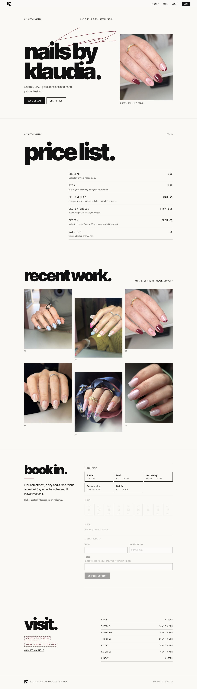
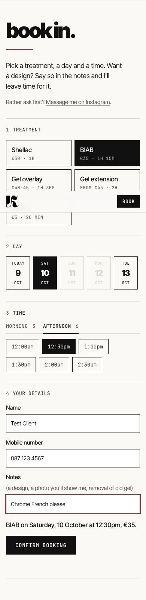
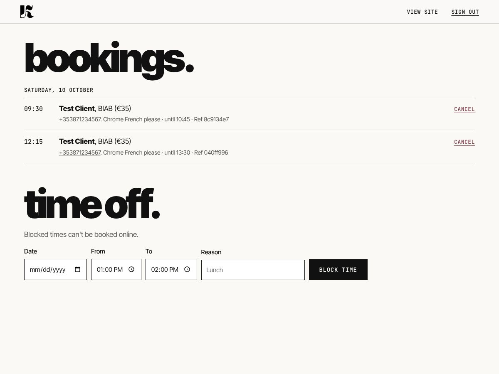

# Nails by Klaudia

Website and online booking for Nails by Klaudia Kociubinska ([@klaudiakanails](https://www.instagram.com/klaudiakanails/)), with no booking-platform fees. A small Node app with no dependencies, built on the same booking diary and sign-in as athlone-barber-club, minus the phone receptionist and text messages.



| Booking on a phone | Klaudia's diary |
| --- | --- |
|  |  |

- **Page** (`public/index.html`, `public/styles.css`): one HTML template, filled in on the server from `config/salon.json`, so prices and details are in the page itself (good for Google and link previews).
- **Booking** (`public/app.js`, `src/bookings.js`, `src/store.js`): pick a treatment, a day, a free time and add a name and mobile. One diary, so no double booking. Stored in `data/bookings.json`.
- **Klaudia's diary** (`/admin`, "Sign in" in the footer): password sign-in, upcoming bookings, cancel, block out breaks or days off. The site sends no texts or emails, so she lets clients know about a cancellation herself.
- **Look**: off-white paper, black heavy lowercase headings in Inter Tight, mono labels in JetBrains Mono and a burgundy scribble, taken from the logo and the 09/26 Instagram price list.

## Run it locally

```bash
cp .env.example .env   # optional
npm start              # http://localhost:3000, diary at http://localhost:3000/admin
npm test               # 13 tests: diary rules, booking API, sign-in, page content
```

## Change prices, hours or details

Edit `config/salon.json`. The page and the booking form read it on every load, so there's no restart. Each treatment's `minutes` is how long it blocks in the diary; a treatment without `minutes` (Design) shows on the price list but can't be booked on its own. Anything still starting with `PLACEHOLDER` shows on the site as "to confirm". The hours and appointment lengths are examples for now. See `OWNER-SETUP.md` for what's still needed.

## Photos

The six photos are in `public/images/gallery/` as `1.jpg` to `6.jpg`, each with alt text in the `gallery` list in `config/salon.json`. To add one, drop the file in and add a line there. The hero photo is `3.jpg`. The K mark in `public/brand/k-mark.png` is cut from the logo; a vector version from the designer would be sharper.

## Deploy

Any host that runs Node 20+ and keeps a persistent disk works. `render.yaml` sets it up on Render with a small disk for the diary (the free plan has no disk, so bookings would vanish on each deploy). Set `ADMIN_PASSWORD` and `PUBLIC_URL` in the host's dashboard.

## Security notes

- `/admin` is protected by `ADMIN_PASSWORD`. With no password set, the diary stays locked. Use a long one.
- Bookings hold names and phone numbers, so add a line to the site's privacy notice and keep the host's region in the EU if you can.
